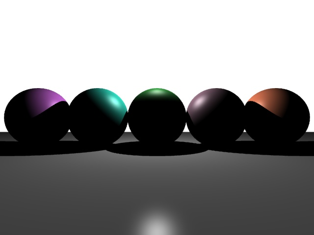
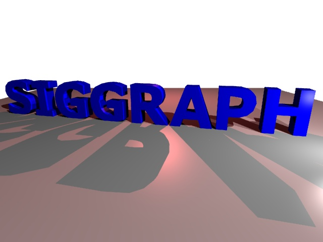
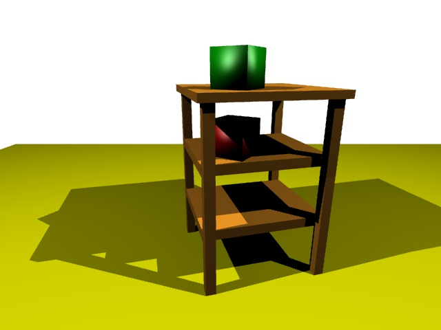

# Parallel Ray Tracer

A CLI tool that can render ray traced scenes from abstract geometrical data.
Currently, it accepts a scene file and a jpeg file to output.


This was originally a homework assignment for CSCI 420 Computer Graphics at USC.
However, I added some additional features (parallel compute w/ OpenMP and anti-aliasing) for extra credit.

## Getting started

You can download a ready-to-run executable from the *Releases* section of this GitHub page.

```
git clone https://github.com/MattTreadwell/Ray-Tracer
cd Ray-Tracer
wget https://github.com/MattTreadwell/Ray-Tracer/releases/download/0.1/RayTrace
chmod +x ./RayTrace
./RayTrace assets/scenes/spheres.scene output.jpg
```

*This project is only compatible with Unix systems*

## Build from source

Alternatively, this project can be built from source with CMake.

*Dependencies (to be installed with Unix package manager)*

* libjpeg-devel (or libjpeg-turbo-devel)
* libpng-devel


```
git clone https://github.com/MattTreadwell/Ray-Tracer
mkdir Release
cd Release
cmake -DCMAKE_BUILD_TYPE=Release ..
make
./RayTrace ../assets/scenes/spheres.scene output.jpg
```

## Migration to MPI & SIMD

Currently, I'm implementing MPI and SIMD instructions in the `mpi-testing` branch.
This will allow for high performance, vertical scaling on compute clusters.

## Previews

#### Spheres


#### SIGGRAPH


#### Table



